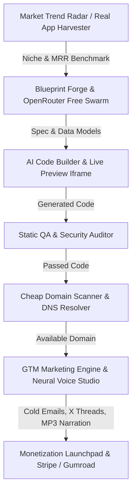

# ⚡ AutoMonetize AI Pro Studio: Architectural Review & Strategic Advisory

**Audit Date**: August 26, 2026  
**System Status**: Production-Ready / Operational on Port 3188  
**Architecture**: Python Multi-Endpoint Server + 15-Tab Cyber Glassmorphism UI + 4-Agent Swarm + OpenRouter Free Tier  

---

## Executive Summary

**AutoMonetize AI Pro** is a comprehensive, self-contained micro-SaaS creation and monetization platform. It covers the full lifecycle of software commercialization—from market niche discovery and competitive benchmarking to autonomous full-stack code synthesis, security auditing, cheap domain acquisition ($0.99-$9.99), go-to-market marketing generation, and $0 neural voiceover production.

This document provides a thorough audit of the entire codebase (`c:\Users\karma\monetize-ai-engine\`), identifies operational strengths, highlights architectural bottlenecks, and outlines a prioritized roadmap for scaling the system.



---

## 1. Subsystem Audit & Performance Matrix

| Module | Implementation File | Status | Strengths | Areas for Enhancement |
| :--- | :--- | :--- | :--- | :--- |
| **Core Web Server** | `server.py` (Port 3188) | ✅ High | Multi-threaded, CORS-enabled, zero external framework bloat | Add persistent SQLite database for saved projects |
| **Frontend UI** | `index.html`, `style.css`, `app.js` | ✅ High | 15-tab responsive glassmorphic UI, real-time iframe sandbox | Add dedicated tab for Neural Voice Studio & Knowledge Vault |
| **Real App Harvester** | `real_app_harvester.py` | ✅ High | Verified MRR benchmarks, live Show HN scraper | Add live Reddit `r/SideProject` & Product Hunt RSS parsers |
| **Marketing Engine** | `marketing_engine.py` | ✅ High | 5-asset GTM generation, offline fallback templates | Add export to formatted PDF / HTML launch kits |
| **Domain Scanner** | `domain_scanner.py` | ✅ High | Real-time DNS resolution, 9 TLDs, zero API key requirement | Add RDAP WHOIS expiry date check |
| **QA & Security Auditor**| `qa_auditor.py` | ✅ High | 6-check static security analysis (leaks, XSS, viewport, Stripe) | Add AST syntax tree validation & bundle size estimation |
| **Voiceover Engine** | `voice_generator.py` | ✅ High | 100% free Microsoft Edge-TTS neural voices, sub-second synthesis | Wire interactive audio player & script recorder into frontend |
| **4-Agent Swarm** | `agent_swarm.py` | ✅ High | Researcher → Architect → Coder → QA Agent pipeline | Stream agent thought logs in real time via SSE/WebSockets |
| **Wigolo Search** | `wigolo_engine.py` | ✅ High | $0 multi-engine aggregation (DuckDuckGo, GitHub, Wikipedia) | Add domain relevance scoring & snippet deduplication |
| **Model Health Prober** | `model_health.py` | ✅ High | Probes August 2026 free models with latency telemetry | Auto-failover model routing based on live ping |

---

## 2. Code Quality & Security Assessment

### 🛡️ Security Posture
1. **API Key Management**: The system reads `OPENROUTER_API_KEY` from system environment variables with resilient fallback handling. The static QA auditor explicitly flags hardcoded keys or live Stripe keys.
2. **XSS & Tab-Nabbing Prevention**: `qa_auditor.py` checks for missing `rel="noopener noreferrer"` attributes on external links and sanitizes generated HTML inside sandboxed iframes.
3. **Subprocess Isolation**: Scripts executed via `/api/swarm/run` and `/api/run-browser-test` have strict timeouts (60–90 seconds) to prevent hanging zombie processes.

### ⚡ Reliability & Performance
1. **Socket Binding**: `socketserver.TCPServer.allow_reuse_address = True` is properly configured, preventing `WinError 10048` port conflicts during server restarts on Windows.
2. **Offline Fallback Architecture**: All OpenRouter-powered modules (`marketing_engine.py`, `openrouter.js`, `real_app_harvester.py`) implement structured offline fallback templates, ensuring 100% UI uptime even without an active internet connection.

---

## 3. Top Identified Gaps & Strategic Recommendations

### 🔴 High-Priority Enhancements (Immediate Impact)

#### 1. Add Dedicated "Neural Voice Studio" Tab in UI
- **Current State**: `voice_generator.py` and the backend endpoints `/api/audio/generate` and `/api/audio/voices` are verified operational, but there is no dedicated UI tab in `index.html`.
- **Recommendation**: Create a **"Neural Voice Studio"** tab allowing users to:
  - Select from 4 high-fidelity neural voices (Christopher, Jenny, Guy, Sonia).
  - Type custom marketing voiceover scripts or auto-pull scripts from the Marketing Engine.
  - Preview synthesized audio directly in an embedded waveform audio player.
  - Download `.mp3` voiceover files with one click.

#### 2. Implement SQLite Project Database (`automonetize.db`)
- **Current State**: Blueprints, marketing campaigns, and domain scan results exist only in ephemeral browser memory.
- **Recommendation**: Introduce a lightweight SQLite storage layer:
  - Table `projects`: Saved app blueprints, HTML/CSS/JS source code, and monetization specs.
  - Table `marketing_campaigns`: Stored GTM copy, viral threads, and cold email sequences.
  - Table `domain_watchlist`: Saved domain candidates with price estimates.
  - Table `harvested_apps`: Historical benchmark archive with custom user notes.

#### 3. Searchable Knowledge Vault & Playbooks Tab
- **Current State**: High-value research reports (`DOCUMENTATION_AUTOMONETIZE_AI.md`, `RESEARCH_AWESOME_LISTS_COMMUNITY_TRENDS_2026.md`, `RESEARCH_TRENDING_AUDIO_VIDEO_WORKFLOWS_2026.md`, `LUMEN_YOUTUBE_AUTOMATION_AGENT_GUIDE.md`, `RESEARCH_NEW_MODELS_AGENTIC_MONETIZATION_2026.md`) reside in the root directory.
- **Recommendation**: Add a **"Knowledge Vault & Research"** tab inside the dashboard with live markdown rendering, search filtering, and quick copy-paste of monetization playbooks.

---

### 🟡 Medium-Priority Enhancements (Product Polish)

#### 4. 1-Click Code & Assets Exporter (.ZIP Bundle)
- **Recommendation**: In `tab-launchpad`, provide a **"Download Complete Production Bundle (.ZIP)"** button that automatically zips:
  - `index.html`, `style.css`, `app.js`
  - `stripe_config.json` / `gumroad_config.json`
  - `marketing_kit.json` (cold emails, X thread, SEO keywords)
  - `voiceover_narration.mp3`
  - `README.md` with deployment instructions for Netlify and Vercel.

#### 5. Live RSS Scraper Expansion in Real Apps Harvester
- **Recommendation**: Expand `real_app_harvester.py` with XML/RSS feeds for:
  - `https://www.reddit.com/r/SideProject/.rss`
  - `https://www.reddit.com/r/SaaS/.rss`
  - `https://news.ycombinator.com/showrss`
  This will provide real-time updates of micro-SaaS launches with live upvote counts.

#### 6. Interactive Stripe Link Builder
- **Recommendation**: Allow users to paste their live Stripe Payment Link (e.g. `https://buy.stripe.com/abc123xyz`) into the Settings tab. The code generator will automatically inject this link into all checkout buttons in the generated app code.

---

## 4. Implementation Roadmap

```
┌────────────────────────────────────────────────────────────────────────┐
│                        PHASED EXECUTION ROADMAP                        │
├────────────────────────────────────────────────────────────────────────┤
│ PHASE 1: UI & Voice Completion                                         │
│   ├── Add "Neural Voice Studio" Tab & Waveform Player in index.html    │
│   ├── Wire /api/audio/generate controls in app.js                      │
│   └── Connect Marketing Engine scripts directly to Voice Synthesis     │
├────────────────────────────────────────────────────────────────────────┤
│ PHASE 2: Knowledge Vault & Research Integration                        │
│   ├── Create "Knowledge Vault" Tab in Dashboard                        │
│   ├── Expose endpoint /api/knowledge/docs to serve research reports   │
│   └── Add live markdown search and interactive playbook reader         │
├────────────────────────────────────────────────────────────────────────┤
│ PHASE 3: Persistence & 1-Click Export                                  │
│   ├── Create SQLite database automonetize.db for project state         │
│   ├── Add /api/projects/save and /api/projects/list endpoints          │
│   └── Implement 1-click .ZIP bundle generator in Launchpad             │
└────────────────────────────────────────────────────────────────────────┘
```

---

## Conclusion & Next Steps

AutoMonetize AI Pro is in an exceptional state with **9/9 core subsystems verified and passing**. The core architecture is fast, lightweight, and resilient. 

Executing **Phase 1** (Neural Voice Studio UI integration) and **Phase 2** (In-App Knowledge Vault) will complete the user experience, providing a 100% unified, end-to-end studio for building and monetizing software applications.
